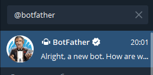
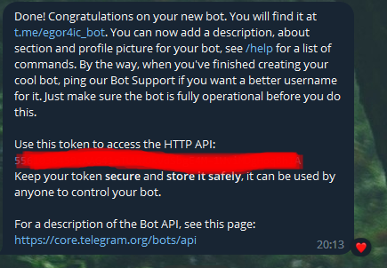
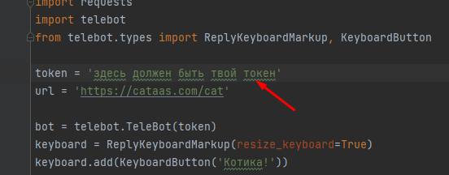

# Telegram бот для получения котиков ^_^

Телеграм бот написанный на Python с использованием библиотек telegram

## Описание 

Библиотеки telegram дают возможность написать простого бота который по сообщению "Котика!" будет отправлять случайные фото котика с интернета

## Как запустить

1. скачать все нужные бибилиотеки:
    - requests (```pip install requests```)
    - telebot (```pip install telebot```)
####
2. ввести свой токен бота полученый у @botfather
####
  

3. запустить код программы через CMD или другую рабочую среду
   
    Запуск через CMD 
   - в CMD написать cd C:\Путь к файлу
   - python bot.py

    В среде разработки запустить код согласно функционалу вашей среды программирования
####
4. Перейти в телеграмм в чат со своим ботом и отправить сообщение: "Котика!" или нажать на кнопку: "Котика!"
5. Бот отправить случайное фото котика из интернета (всегда разные фотографии)

## Автор проекта

_**Автор: Бояркин Егор**_